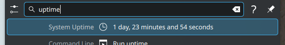

# krunner-uptime

A very simple KDE Plasma 6 KRunner plugin that displays the current system uptime. Partially a learning project for working with KDE libraries, Qt, CMake and packaging.

The trigger word defaults to "uptime" in English, but can be configured by setting the `trigger` property under the `[Runners][krunner_uptime]` section in your `krunnerrc` file.

Pull requests of any kind welcome!

# Credits

Some innards of this plugin and the specifics of the build/CI workflow are heavily inspired by similar projects, including:

* https://github.com/domschrei/krunner-symbols
* https://github.com/alex1701c/EmojiRunner
